```{r setup, include=FALSE}
knitr::opts_chunk$set(echo = FALSE)
```
 
# Course Introduction and Motivation

## (Virtual) welcome to Sheffield


[http://www.welcometosheffield.co.uk/visit](http://www.welcometosheffield.co.uk/visit)


## Course Structure

- Week 1; Data management and spreadsheets
- Week 2; R introduction and importing spreadsheets
- Week 3; Manuipulating tables and plotting
- Week 4; More plotting and summarising
- Week 5; statistics (t-tests, non-parametric tests and ANOVA)

## How you will learn

- Reviewing the pre-recorded videos and completing exercises
- Live teaching / demonstrating
    + Recorded and available afterwards
- Exercises in breakout groups

## What you will not learn

- Bioinformatics
    + RNA-seq, Sequencing alignment etc
- Machine Learning, A.I. etc
- You will not become an R *expert* after the course
    + you will hopefully feel confident to start your own analysis and **how to get help**

# Introduction to R
 
## Motivation


## Notable uses

- [Facebook](http://blog.revolutionanalytics.com/2010/12/analysis-of-facebook-status-updates.html),
- [google](http://blog.revolutionanalytics.com/2009/05/google-using-r-to-analyze-effectiveness-of-tv-ads.html),
- [Microsoft](http://blog.revolutionanalytics.com/2014/05/microsoft-uses-r-for-xbox-matchmaking.html) (who recently [invested](http://blogs.microsoft.com/blog/2015/01/23/microsoft-acquire-revolution-analytics-help-customers-find-big-data-value-advanced-statistical-analysis/) in a commerical provider of R)
- The [New York Times](http://blog.revolutionanalytics.com/2011/03/how-the-new-york-times-uses-r-for-data-visualization.html).
- [Buzzfeed](http://blog.revolutionanalytics.com/2015/12/buzzfeed-uses-r-for-data-journalism.html) use R for some of their serious articles and have made the code [publically available](https://buzzfeednews.github.io/2016-04-federal-surveillance-planes/analysis.html)
- The [New Zealand Tourist Board](https://mbienz.shinyapps.io/tourism_dashboard_prod/) have R running in the background of their website
- The BBC makes code available for some of their stories (e.g. [gender bias in music festivals](https://github.com/BBC-Data-Unit/music-festivals))
- [Airbnb](https://medium.com/airbnb-engineering/using-r-packages-and-education-to-scale-data-science-at-airbnb-906faa58e12d)

## An example from mainstream media


## Biological examples

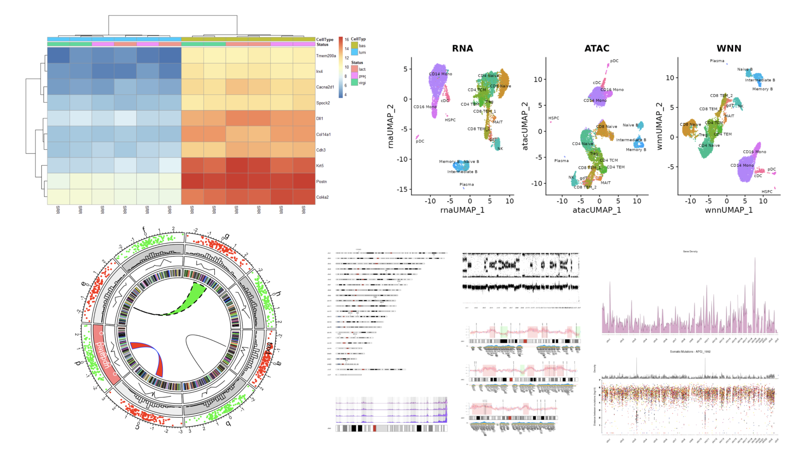

## Topics covered

- The Rstudio environment
- Importing data from a spreadsheet
- Filtering Data
- Plotting
- Calculating numerical summaries
- Reporting
- Joining data from multiple spreadsheets
- Statistical Analysis


## Packages covered

- We will cover a very small set of packages - the **tidyverse**


_Image Credit:_ [***Aberdeen Study Group***](https://aberdeenstudygroup.github.io/studyGroup/lessons/SG-T2-JointWorkshop/PopulationChangeSpeciesOccurrence/)


## Can't we just do these things in Excel?

- Spreadsheets are a common entry point for many types of analysis and Excel is used widely but
    + can be unwieldy and difficult to deal with large amounts of data
- error prone (e.g. gene symbols turning into dates)
- tedious and time consuming to repeatedly process multiple files
- how can you, or someone else, repeat what you did several months or years down the line? 


## Course Data

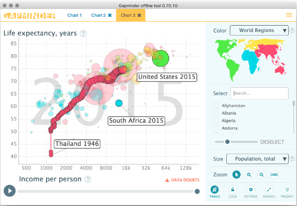

- We will use data from the gapminder project

## Example plots

- By the end of the course we will be creating plots like this in a few lines of code

```{r echo=FALSE, message=FALSE,fig.width=8,warning=FALSE}
library(tidyverse)
gapminder::gapminder %>% filter(year==1977) %>% ggplot(aes(x = gdpPercap, y=lifeExp,colour=continent,size=pop)) + geom_point()+ scale_x_log10() + scale_color_brewer("Continent",palette = "Set1") + scale_size_continuous("Population in 1977")
```

## Example plots

```{r fig.width=8,message=FALSE}
gapminder::gapminder %>% filter(country %in% c("Zambia","Rwanda","Zimbabwe","United Kingdom","Spain","Germany")) %>% ggplot(aes(x=year, y=lifeExp,col=country)) + geom_point() + geom_smooth() + facet_wrap(~country) + scale_color_brewer("Country",palette = "Set2")
``` 

## R as a reporting tool

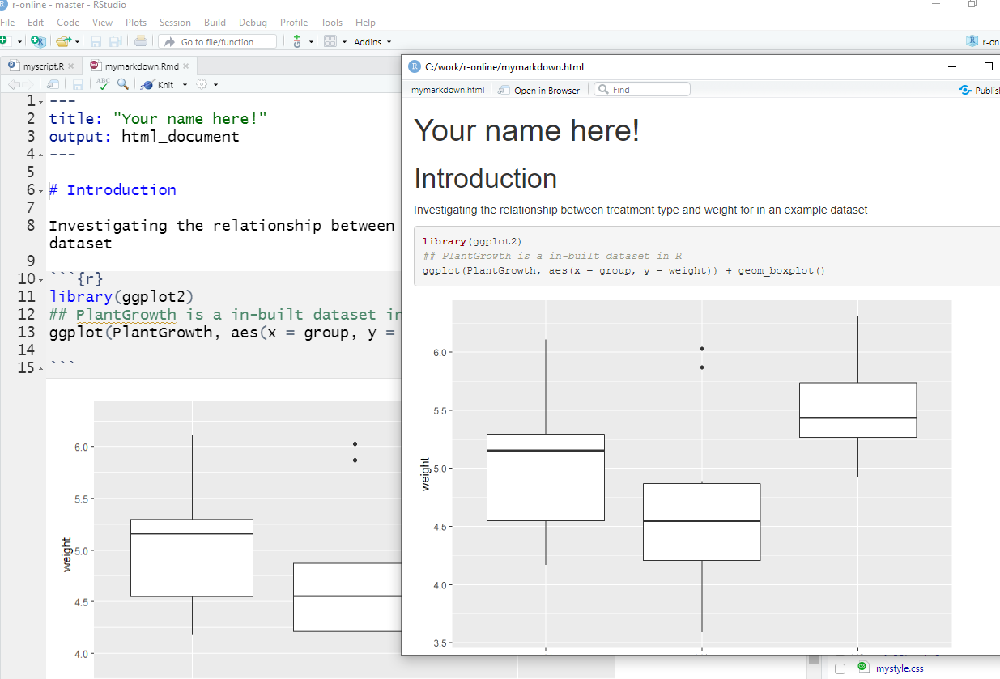

## Reproducibility Crisis

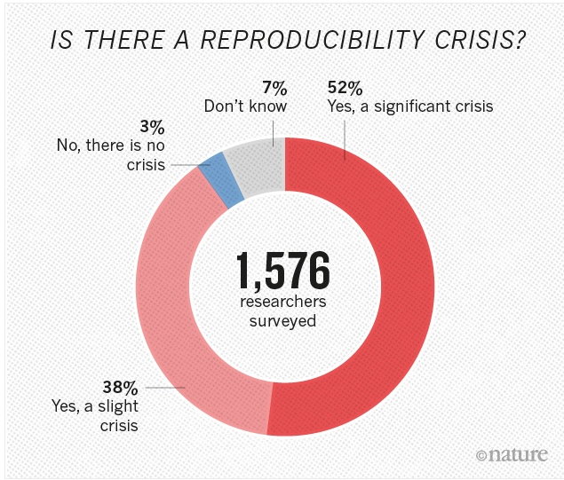

## Reproducibility Crisis

<iframe width="420" height="315" src="https://www.youtube.com/embed/7gYIs7uYbMo" frameborder="0" allowfullscreen></iframe>

## Talk "highlights"

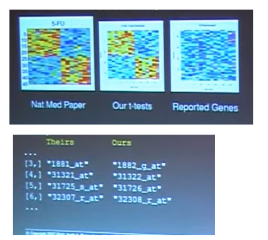

## Reproducible Research

- At some point in the future, someone, somewhere, might want to repeat your analysis for themselves or re-use your data. 
    + which will most likely be ***you!***
- Assuming that you'll be able to remember all the steps involved is dangerous, so making sure that everything is well-documented is key. 

## Why share data?

- Build research profile
- Demonstrate validity of results
- Contribute to the community
- Because you have to!

## How to share data

- Domain-specific repository is best
- https://www.re3data.org/ Registry of Research Data Repositories
    + Gene Expression Omnibus
    + ArrayExpress
    + European Genome Archive
- Your website
- Figshare, Zenodo, institutional repository
- **Have a data management plan in place from the start**

## Things can go wrong


Fire at CRUK Manchester - April 2017

## Things can go wrong


## Discussion

- In your breakout groups discuss
    + what kind of research data do you have?
    + what backup strategies do you have?
    + how do you share files / data with collaborators?
    
## Data Backup

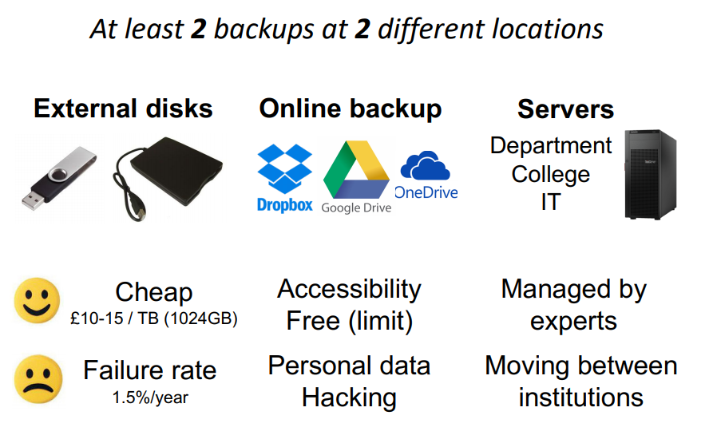

Credit: CRUK_CI Bioinformatics Core 


## Data Backup

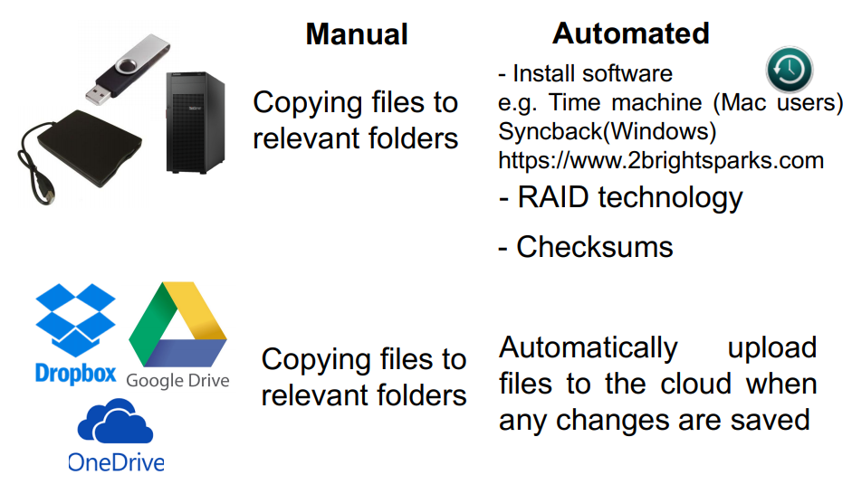

Credit: CRUK_CI Bioinformatics Core   

## Version Control


Credit: PhD Comics


## Version Control

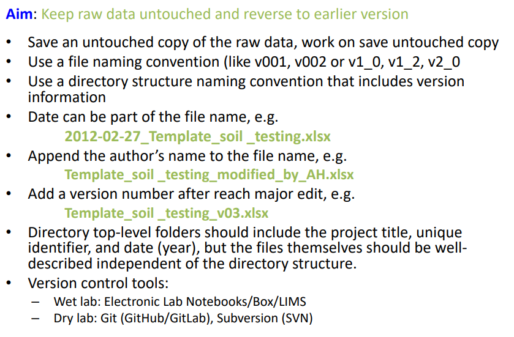

Credit: CRUK_CI Bioinformatics Core    
 
## More advanced Options


- Consider learning about git and github for version control
- Automatic tracking of changes, person that made the changes and the reasons for it
- Interacts nicely with RStudio
- For more, see here:- [Friendly Github Intro](https://kirstiejane.github.io/friendly-github-intro/)
    
## Naming of files and directories


    

## Naming of files and directories

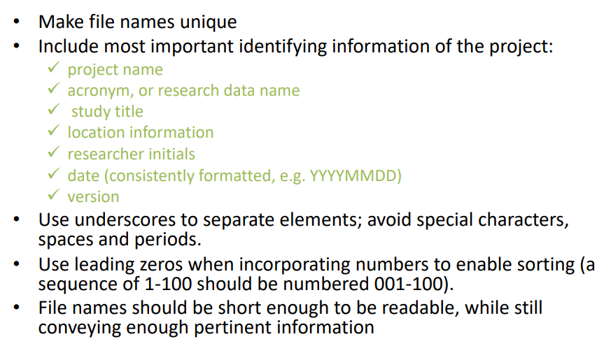

Credit: CRUK_CI Bioinformatics Core

## Naming of files and directories

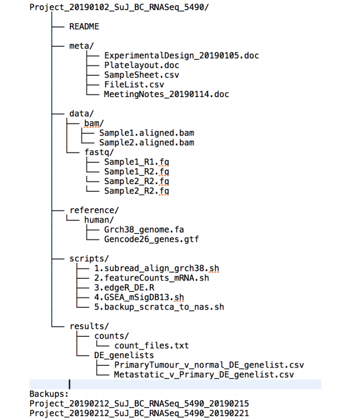

Credit: CRUK_CI Bioinformatics Core


# Spreadsheet Organisation
 
## Context


 
## Context 
 
- What the wet-lab scientists wanted us to spend time looking at

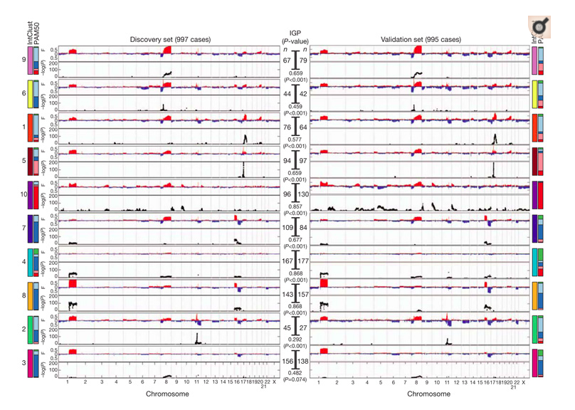

## Context

- What we *actually* spent time looking at (Disclaimer: not actual data from this project)

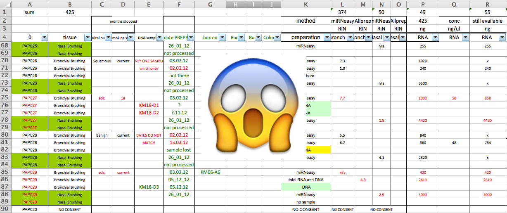

## Context

No matter how much of the analysis is automated, some manual steps are inevitably involved

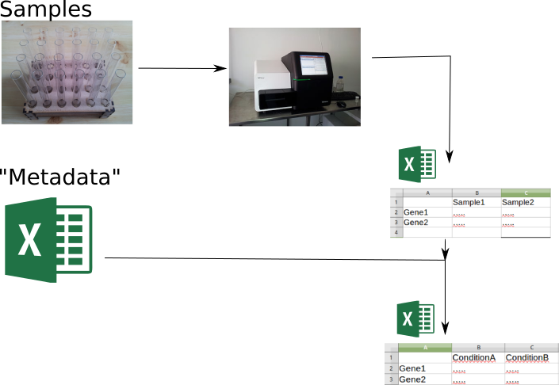


## Reproducible Research

- An analysis needs to be *automated* to be properly reproducible
- Tools like R, Python, will help with this but the data needs to be formatted correctly in the first place
    + R, Python cannot magically read any type of file you give them
- **Making spreadsheets tidy at the start of the analysis will save a lot of time in the long-run**


## Should we stop using Excel completely?

- ....Not neccesarily.
- Often much more convenient to eye-ball a spreadsheet and get an overall impression of your data. 
- But they have *limitations* making them not ideal for large-scale analyses. 
- Doing things by-hand only invites you to make copy-and-paste errors etc


## Rule 1


## Rule 1 - ***Never work directly on the raw data***


## Rule 1

- ***Never work directly on the raw data***
- Hard to reverse all the manual steps performed and invites errors
- Store the original data somewhere safe
    + see later
    


## Rule 2

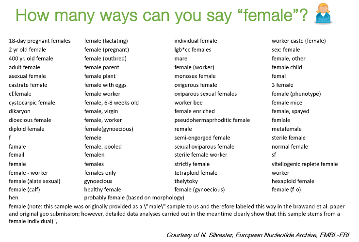


## Rule 2 - ***Maintain consistency***


## Example 1

| Patient ID | Sex    | Date of Diagnosis     | Tumour Size
|------------|--------|-------------------|------------
| 1          | M      | 01-01-2013        |     3.1
| 2          | f      | 04-18-1998        |     1.5
| 3          | Male   | 1st of April 2004 |     105
| 4          | Female | NA                |     67
| 5          | F      | 2010/03/12        |     4.2
| 6          | F      |                   |     3.6
| 7          | M      | 1994-11-05T08:15:30-05:00         |     232


## Example 1

- Consistency: F, female, f, fem, 2, …
- Units
    + cm or mm; days, months or years
- You can introduce inconsistencies without realising it
    + blank spaces (whitespace) at the end of text
    + "Male " is not the same as "Male"
- Document choices you make about units in a *README* file


## Regarding dates

credit: @myusuf3


## Example 1 - corrected

| Patient ID | Sex  | Date of Diagnosis | Tumour Size
|------------|------|---------------|------------
| 001          | M    | 2013-01-01    |   3.1 
| 002          | F    | 1998-04-18    |   1.5
| 003          | M    | 2004-04-01    |   1.05
| 004          | F    | NA            |   0.67
| 005          | F    | 2010-03-12    |   4.2
| 006          | F    | NA            |   3.6
| 007          | M    | 1994-11-05   |   2.32


## Rule 3

Figure showing locations of visitors to my Prostate Cancer [data portal](http://bioinformatics.cruk.cam.ac.uk/apps/camcAPP/)

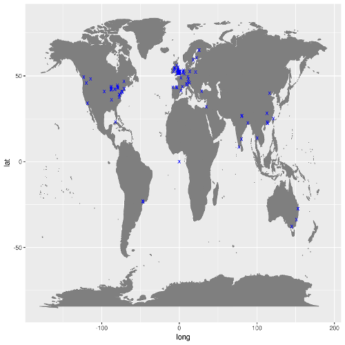


## Rule 3 - Don't use 0 to mean missing

- Zero values are data!
    + Sometimes extreme values such as 999 are sometimes used
- `NA` is Ok, but what if NA is a valid category in your data?
    + R will recognise `NA` as a missing value and can ignore it in calculations
- Safest to leave the cell *empty*
    + but you need to be careful with blank spaces


## Rule 4

| Patient ID | Date       | Value |
|------------|------------|-------|
| 1          | 2015-06-14 | 213   |
| 2          |            | 76.5  |
| 3          | 2015-06-18 | 32    |
| 4          |            | 120.3 |
| 5          |            | 109   |
| 6          | 2015-06-20 |       |
| 7          |            | 143   |


## Rule 4 

 Fill in all the cells


## Rule 4

- It is tempting to make the table look cleaner by not repeating some values
- Fill in all cells!
    + otherwise, problems when sorting
- Empty cell:
    + missing value?
    + value meant to be repeated multiple times?
- Make sure it’s clear that the data is missing and not unintentionally left blank


## Example 2 Corrected

| Patient ID | Date       | Value |
|------------|------------|-------|
| 1          | 2015-06-14 | 213   |
| 2          | 2015-06-14 | 76.5  |
| 3          | 2015-06-18 | 32    |
| 4          | 2015-06-18 | 120.3 |
| 5          | 2015-06-18 | 109   |
| 6          | 2015-06-20 | NA    |
| 7          | 2015-06-20 | 143   |


## Rule 5

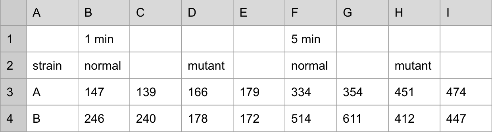


## Rule 5

Make it rectangle

- The computer expects a very rigid shape of data with rows and columns
- Each column is a *variable* being examined
- Each row is an observation
- A concept commonly known as [*tidy data*](http://vita.had.co.nz/papers/tidy-data.pdf)


## Rule 5

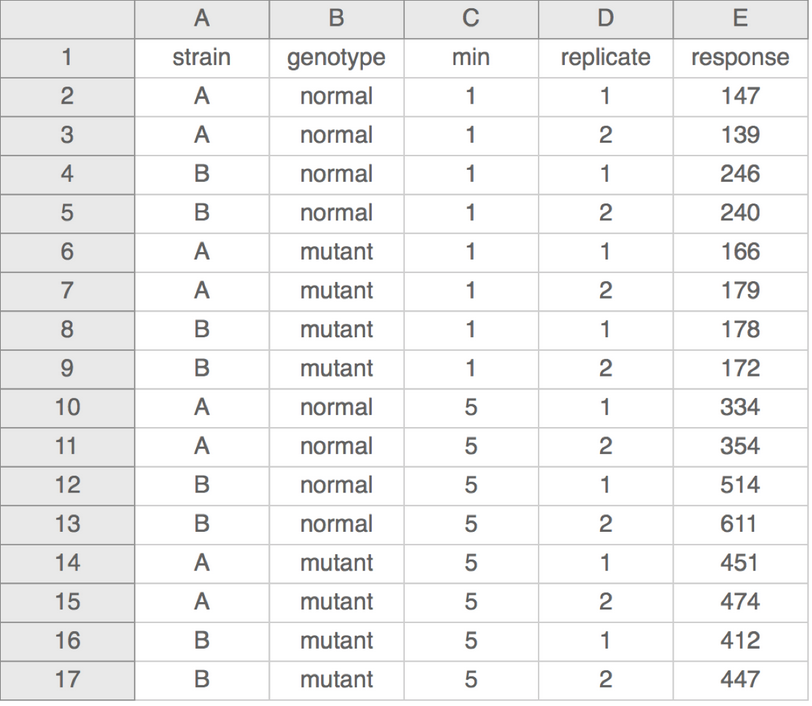


## More

- Don’t put too much information in one cell
    + 1 cell = 1 piece of information
- Don’t include units such as "30 g" → "g" in the column name
    + http://unitsofmeasure.org/ucum.html 
- Write notes in a separate column or data dictionary or metadata 
    + "0 (below threshold)"
    


## More

- NO calculations
- NO font colours
- NO highlighting

Computer doesn’t recognize it!


## Heplful Data Validation feature in Excel

- Excel data validation feature
- Select a column
    + In the menu bar, choose “Data”
    + Validation
- Integer or decimal number
- Range
- List of possible values
- Limited length text


## Less helpful "features" in Excel

- When identifiers are long integers
    + 1000000 = 1e06
    + [Issue with Illumina microaray chip IDs](https://support.illumina.com/bulletins/2016/10/important-information-about-using-digit-beadchip-barcodes-in-genomestudio-sample-sheets.html)
- [Excel can convert gene names to dates](https://genomebiology.biomedcentral.com/articles/10.1186/s13059-016-1044-7)
    + SEPT2 (Septin 2) → ‘2-Sep’
    + MARCH1 (Membrane-Associated Ring Finger (C3HC4) 1, E3 Ubiquitin Protein Ligase) → ‘1-Mar’


